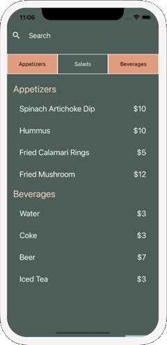
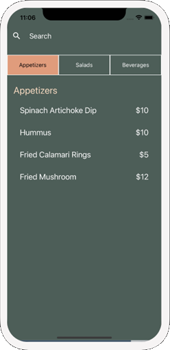
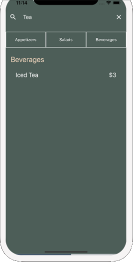

# React Native Data Management Project

## Introduction

Welcome to the React Native Data Management Project! This project is a practical application of the skills I acquired through a comprehensive data management course. Throughout the course, I learned how to efficiently handle data in React Native applications, covering essential aspects such as fetching data from remote APIs, storing data locally, and seamlessly displaying it in user interfaces.

## Purpose

The primary purpose of this project is to demonstrate a robust and well-organized approach to managing data in a React Native environment. By implementing best practices learned from the course, the project aims to showcase:

- **Efficient Data Fetching:** Demonstrates the proper implementation of fetching data from remote APIs, ensuring a smooth and responsive user experience.

- **Local Data Storage:** Illustrates the efficient storage of data locally, enhancing the app's performance and offline capabilities.

- **User Interface Integration:** Showcases the seamless integration of retrieved data into user interfaces, providing a visually appealing and user-friendly experience.

## Contact

For any questions or inquiries, feel free to reach out:

- Email: weaam_alagha@hotmail.com
- LinkedIn: [Weaam Alagha](https://www.linkedin.com/in/weaam-alagha/)

## Usage

Here is a screenshot of the application in action:

